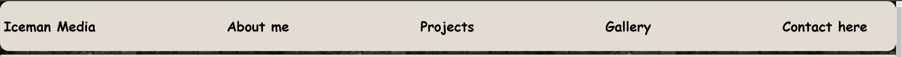

# Iceman Media

Iceman Media is my personal photography website, but it's not only an introductory site. In the hopefully near future, when the website will be finished it will offer a gallery for the ones who want to see my hobby and work, but also it will be a showroom for people who want to be my customer and wish to receive a full website for their own or company with self made professional photography and unique design.

For more visit here: https://is2dann.github.io/IcemanMedia2

## Features

Typography and Color scheme

I wanted to go simple yet stylish on the design.
The whole website uses only one font (cursive) and the color scheme is basically tan (#E4DCD1) and black (#000000).
Has a black brick background and a hint of (aqua) resembling "ice" to spice up some parts (see "send it" button).

### Existing features

-_Header as navigation bar_
* Includes 5 links total. 
* The name is directs to the top of the first page from any other page.
    - The "About me" and "Projects" are take the user to the corresponding part of the first page.
    - The "Gallery" is the second page of the website.
    - The 4th page is the "Contact here"
* All links are responsive and consistent on all 4 pages, plus on the "Thank You" page (which can be seen through filling out the contact form).

    
    
-_Header part 2_
* Below the header, a small section contains:
    - A logo (made by me using [Canva logo creator](https://www.canva.com)).
    - A welcome message.
    - A short quote from a famous photographer.

    